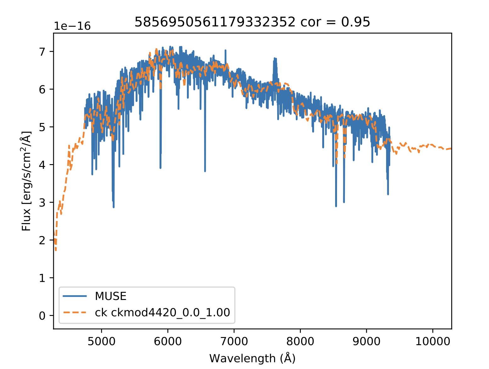

Creates a simulated IFU containing all Gaia stars, which is then subtracted from the input IFU. PSFs are modelled from the input data cube and can be trailed. The pipeline performs a basic source match with the Gaia catalogue, and uses the Gaia positions to identify stars. Stellar spectra are extracted through PSF photometry for each star which is used to determine the rough spectral type of the star. Spectra matching is done by maximising the correlation between the IFU star spectrum and the CK model stellar spectral catalogue, accounting for extinction. The highest correlating stelar spectra are normalised by Gaia G band photometry and injected into a simulated data cube using the IFU PSF. A secondary flux corection is performed on the IFU to best match the flux values of calibration sources to the Gaia scaled photometry. The simulated 'scene' is subtracted from the calibrated IFU and saved out as a fits file.

The output fits file has the format:
 - extension 0: primary hdu
 - extension 1: differenced cube
 - extension 2: error cube
 - extension 3: fits table for PSF parameters


To install:
`pip install git+https://github.com/CheerfulUser/cube_scene.git`

Example reduction for highly trailed 2I Borisov MUSE data:
```python
from cuber import cuber
ifu = cuber(file='filename',cal_maglim=20,run=True)
```


Example of a star spectral fit:




# Current limitations
* Matching IFUs with bad spatial WCS solutions to Gaia can sometimes fall over.
* Flux calibration artifacts still exist across MUSE data cubes, cause unknown.
* Need to add simultaneous PSF fitting for close sources.
* If stars are very long streaks that are not contained on the detector the WCS matching and PSF fitting may struggle.
* Need to add in a method for inputting custom source catalogues.
* Spectral fits aren't perfect, but currently do a good enough job.


