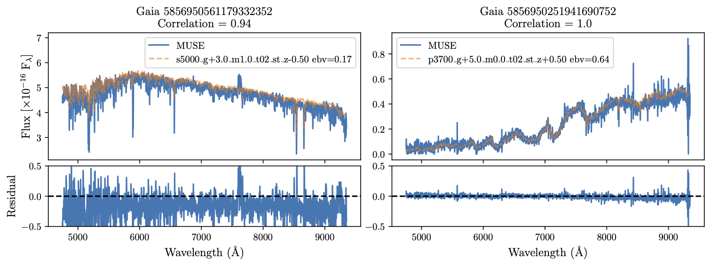
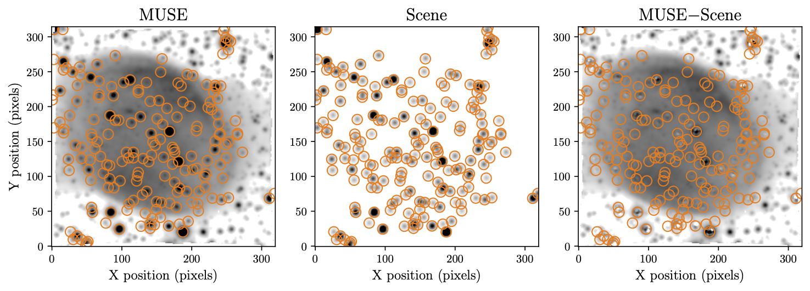
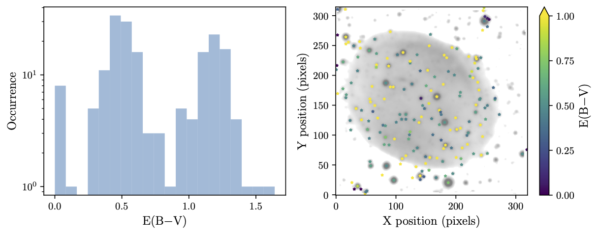

# Starkiller: Removing stars and satellite streaks from IFU data
Starkiller Creates a simulated IFU containing all input catalog stars, which is then subtracted from the input IFU. If no catalog is provided then Gaia DR3 will be downloaded. PSFs are modelled from the input data cube and can be trailed. The pipeline performs a basic source match with the input catalogue, and uses the catalog positions to identify stars. Stellar spectra are extracted through PSF photometry for each star which is used to determine the spectral type of the star. Spectra matching is done by maximising the correlation between the IFU star spectrum and the CK model stellar spectral catalogue, accounting for extinction. The highest correlating stelar spectra are normalised by specified catalog band (Gaia G by default) photometry and injected into a simulated data cube using the IFU PSF. A secondary flux corection is performed on the IFU to best match the flux values of calibration sources to the Gaia scaled photometry. The simulated 'scene' is subtracted from the calibrated IFU to create a synthetic differenced cube whcih is saved out as a fits file.

The output fits file has the format:
 - extension 0: primary hdu
 - extension 1: differenced cube
 - extension 2: error cube
 - extension 3: fits table for PSF parameters


To install:
`pip install git+https://github.com/CheerfulUser/starkiller.git`


Example reduction for highly trailed 2I Borisov MUSE data:
```python
from starkiller import starkiller
ifu = starkiller(file='file',cal_maglim=20,run=True)
```


Example of a star spectral fit:




## Sidereally tracked data
Starkiller can also be applied to sideally tracked data, such as this nebula example:
```python
from starkiller import starkiller
ifu = starkiller(file='file',numcores=7,savepath='filename',spec_catalog='ck+',
				 psf_profile='gaussian',cal_maglim=18,model_maglim=25,
                 psf_preference='data',fuzzy=True,trail=False)
```


While work is still needed to identify how physical the extinction values generated by starkiller are they can be accessed and used for analysis by taking the `ifu.ebvs`. For the nebula example above we can generate the following:


## Satellite removal
Starkiller can use the `sat_killer` class to model and subtract satellite streaks from IFU datacubes. In the example below we use starkiller to remove the satellite spectrum from the cube, recovering the Blazar spectrum. The following code snipet enables this functionality:
```python
from starkiller import starkiller
ifu = starkiller(file='file',spec_catalog='ck',savepath='filename',satellite=True)
```


If we look at the Blazar spectrum from the Raw and Satellite Subtracted MUSE datacubes we can see that starkiller has successfully removed the satellite continuum from blazar spectrum (left). The satellite spectrum is consistent with a highly extincted solar spectrum (right).


# Papers where it is used

Starkiller was developed for and first used on the MUSE 2I/Borisov data to remove contamination of streaked sources. More information on this can be found in Deam et al. 2024. Through starkiller we are able to recover observations of this unique transient event that would otherwise have been dropped from the analysis. Examples of the data improvement are shown in the before and after images below. 


# Current limitations
* Need to add simultaneous PSF fitting for close sources.
* If stars are very long streaks that are not contained on the detector the WCS matching and PSF fitting may struggle.


